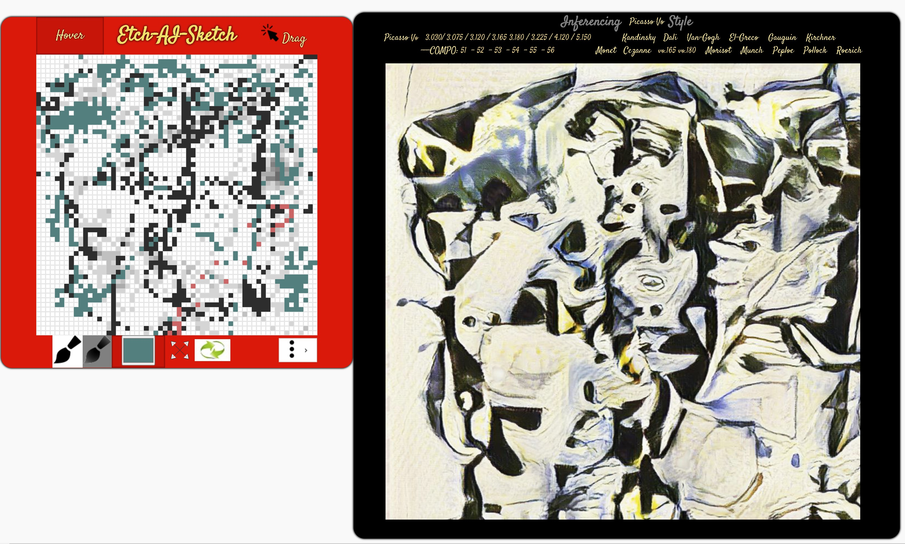
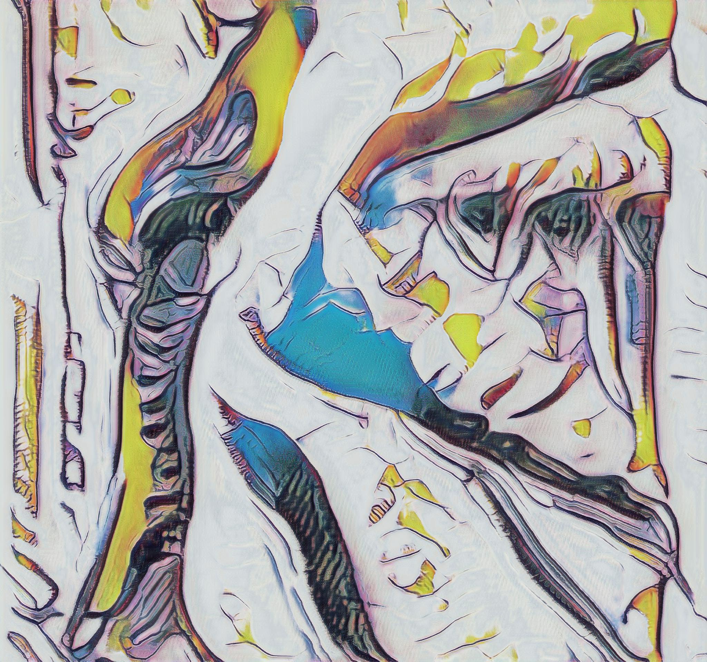

# EtchAI

Classic "Etch-A-Sketch" board, in which one can make pixelated sketches on the canvas and get an AI stylized image from various artists.


The board supports three possible styles, and two possible modes of applying these styles. The styles can all be combined with the modes to provide six possible variations for sketching.

**Hover** is a mode-type that sketches the canvas by hovering the mouse over it.

**Drag** is a mode-type that sketches the canvas by dragging the mouse over it.

**Default** is a style-type that colors the canvas with solid black.

**Transparent** is a style-type that colors the canvas with low-opacity solid black, which gets progressively darker as each pixel area is passed over repeatedly.

**Colorized** is a style-type that colors the canvas with a random solid color for every pixel area.


**render**   is used to render the current sketch using the selected model.

The **Clear** button empties the canvas of any applied changes, but retains the selected mode- and style-types.

**menu**  Option such as Clear and Set to auto-refresh.

The **Resize** button creates a prompt that accepts a given value from 1 to 60, which will change the canvas to represent that value for every row and column (for example, passing a value of 20 will create a grid of 400 pixel areas).

Finally, the label **Etch-A-Sketch** also acts as a reset button. Pressing it will remove all applied changes, including on the canvas and the selected mode- and style-types.

That's it!

----

## Forked Intentions

* Etching and getting a stylized by AI interpretation on the side.
* Peak on what neural network will offers to us





----

# About the UI

A Javascript web Ui of Ben Smith's Etch-a-sketch has been hooked up with code to generate an AI stylized image on the side.

## Versions

When running the web server, you will have various version you can use.

see: index.html  index.html.old  index2.html  v1.html  v2.html  v3.html  

ie:  http://127.0.0.1:8080/v1.html


### Docker server

```sh
docker run -it --rm -p 8080:8080 docker.io/guillaumeai/ast:etchai
```


### Local server

```sh
npm i http-server
cd $MYREPO
http-server
```


## limitations and Issues

* The process of rendering AI on the side is really consuming resources. In the process of making that a bit more effective, You will notice UI glitches, button not responding.  Just Click the "Hover" button on the top or the "Size"  button
* Hey, get involved, debug it :) :)

# Astia Service

That's the service you are require to run on the side for etching.  (note that some model you can choose on the top of the right (AI) are personal model that are not public.   Bellow are some of the public models I packed in a Docker container your can run.)

## Run an Astia Service on Docker

The trained AI model is packed in a Docker repo  [docker.io/guillaumeai/ast](https://hub.docker.com/repository/registry-1.docker.io/guillaumeai/ast/tags)

```sh
# docker Launch

modeltag=picasso
serverport=9010
docker pull guillaumeai/ast:$modeltag
docker run -it --rm -e SPORT=$serverport -p $serverport:8000 guillaumeai/ast:$modeltag

docker pull guillaumeai/ast:cezanne
docker run -it --rm -e SPORT=9007 -p 9007:8000 guillaumeai/ast:cezanne

# Other model (see in the index.html)
# TODO Write a Running Script
el-greco
9041

morisot
9044

gauguin
9042

kirchner
9043

monet
9014

munch
9045

peploe
9046

pollock
9047

roerich
9048

van-gogh
9011

```


